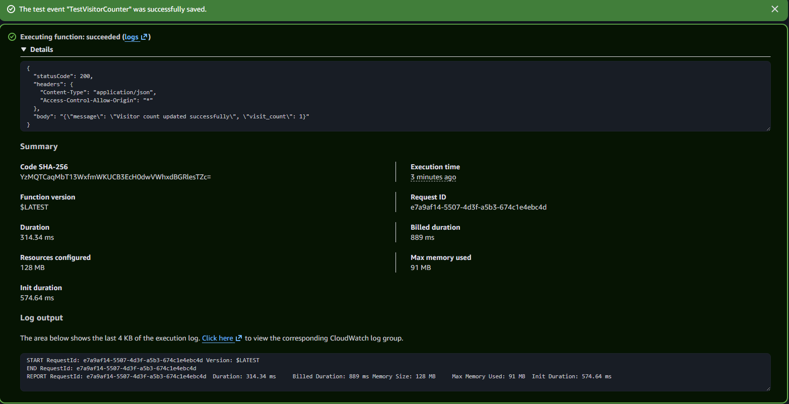
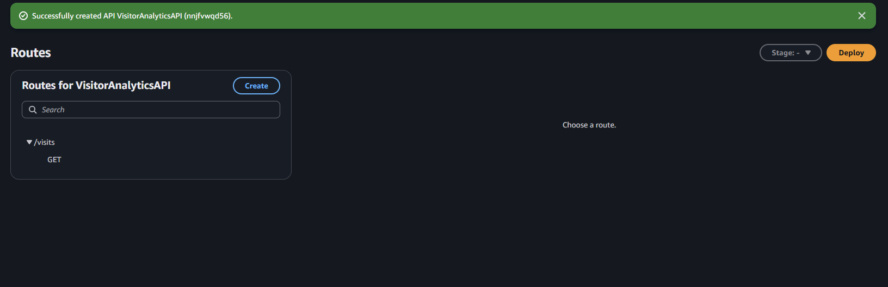
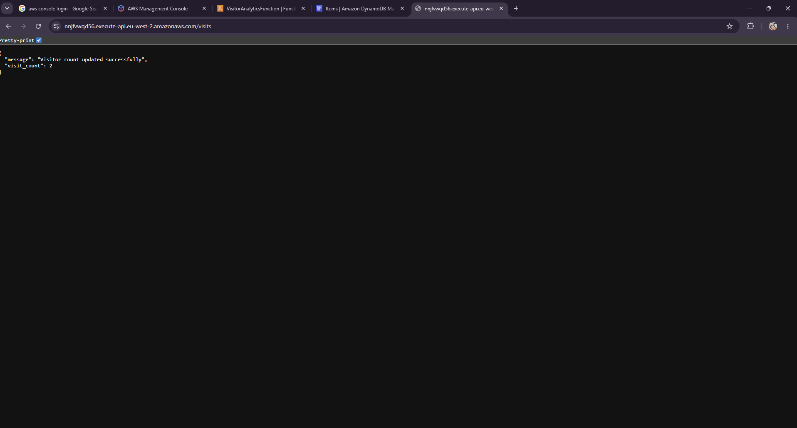
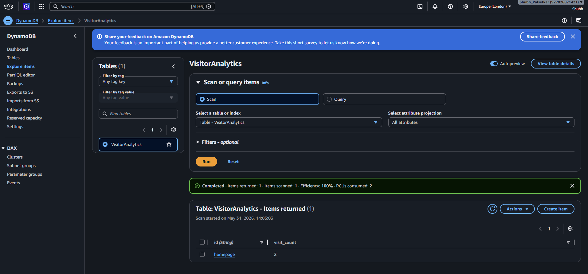

# Serverless Visitor Analytics Platform — AWS Lambda, API Gateway, DynamoDB & CloudWatch

## Project Overview

This project demonstrates a serverless visitor analytics backend built using AWS managed services. The system exposes an HTTP API endpoint that triggers an AWS Lambda function, updates a visitor count stored in Amazon DynamoDB, and records execution logs in Amazon CloudWatch.

The architecture is designed to be lightweight, cost-aware, scalable, and suitable for unpredictable traffic without managing servers.

## Architecture

```text
User / Browser
     ↓ GET /visits
Amazon API Gateway HTTP API
     ↓
AWS Lambda Function
     ↓
Amazon DynamoDB
     ↓
Amazon CloudWatch Logs
```

## AWS Services Used

- Amazon API Gateway
- AWS Lambda
- Amazon DynamoDB
- Amazon CloudWatch Logs
- AWS IAM

## Features

- Serverless REST-style API endpoint
- Visitor count tracking
- DynamoDB persistent storage
- Lambda-based backend logic
- CloudWatch logging and monitoring
- Least-privilege IAM role permissions
- Cost-aware pay-per-request architecture

## Implementation Steps

1. Created a DynamoDB table named `VisitorAnalytics`
2. Created an AWS Lambda function using Python 3.12
3. Added Lambda logic to update visitor count in DynamoDB
4. Configured IAM permissions for Lambda to access DynamoDB and CloudWatch Logs
5. Created an API Gateway HTTP API
6. Added a `GET /visits` route
7. Connected API Gateway to Lambda
8. Tested the public API endpoint in the browser
9. Verified updated visitor count in DynamoDB
10. Captured CloudWatch logs for successful Lambda execution

## Screenshots

### Lambda Test Success



### API Gateway Route



### API Browser Response



### DynamoDB Visitor Count



## Skills Demonstrated

AWS Lambda • API Gateway • DynamoDB • CloudWatch • IAM • Serverless Architecture • REST APIs • Python • Event-driven Design • Cost Optimization

## Cost Optimization

This project uses AWS managed serverless services and avoids always-running infrastructure such as EC2 instances, NAT Gateways, Load Balancers, or RDS databases. The architecture is suitable for low-cost experimentation and Free Tier-friendly usage.

## Author

Shubh Palsetkar  
AWS Certified Solutions Architect – Associate